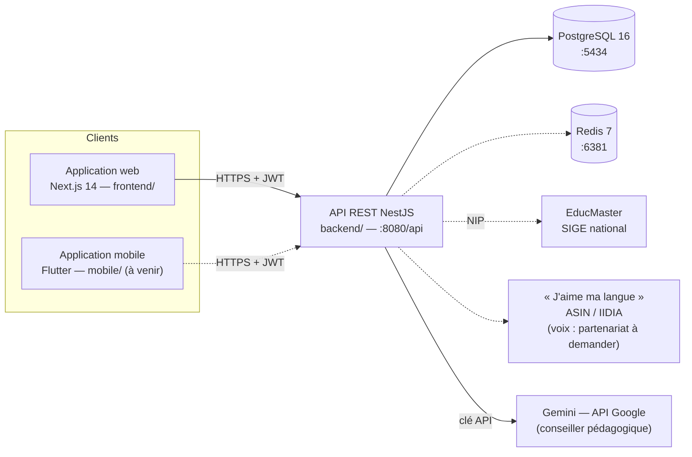

# Mon Orientation

**Plateforme nationale d'orientation scolaire — République du Bénin**

Mon Orientation accompagne les élèves, de la 4e à la Terminale, et leurs parents dans leurs choix d'orientation. La plateforme regroupe :

- un catalogue national de l'offre de formation ;
- le bilan des notes de l'élève ;
- la saisie des vœux ;
- des recommandations explicables ;
- un conseiller pédagogique ;
- des tableaux de bord de pilotage pour le niveau central.

Elle est conçue pour le Ministère des Enseignements Secondaire, Technique et de la Formation Professionnelle (MESTFP). Elle s'appuie sur **EducMaster**, le système d'information et de gestion de l'éducation (SIGE) national, et sur le **NIP**, identifiant unique de l'apprenant.

| Document | Contenu |
|---|---|
| [SPEC.md](SPEC.md) | Cahier des charges fonctionnel (composantes, rôles, contraintes, points à arbitrer) |
| [ARCHITECTURE.md](ARCHITECTURE.md) | Stack, modèle de données, API, sécurité, déploiement |
| [DESIGN.md](DESIGN.md) | Personas, parcours, maquettes, design system (DSBJ), accessibilité |
| [TASKS.md](TASKS.md) | Découpage des tâches et statuts |
| [JOURNAL.md](JOURNAL.md) | Journal de bord : état actuel, historique, prochaine action |
| [backend/README.md](backend/README.md) | API NestJS : installation, configuration, endpoints, moteur d'orientation |
| [frontend/README.md](frontend/README.md) | Application web Next.js : pages, authentification, design system |
| [mobile/README.md](mobile/README.md) | Application Flutter : état et plan d'initialisation |
| [tests/README.md](tests/README.md) | Tests de bout en bout (API et navigateur) |

---

## Sommaire

1. [État d'avancement](#état-davancement)
2. [Architecture](#architecture)
3. [Structure du dépôt](#structure-du-dépôt)
4. [Prérequis](#prérequis)
5. [Démarrage rapide](#démarrage-rapide)
6. [Comptes de démonstration](#comptes-de-démonstration)
7. [Commandes utiles](#commandes-utiles)
8. [Tests](#tests)
9. [Conventions de travail](#conventions-de-travail)
10. [Dépannage](#dépannage)

---

## État d'avancement

| Composante (SPEC §5) | État |
|---|---|
| 5.1 Catalogue national de l'offre de formation | ✅ 67 filières réelles, chaque fiche cite ses sources ; recherche sans accents (métiers et lieux compris), filtres par domaine, série de bac, bourses et source officielle, « Et après ce bac ? », comparateur, formations mises de côté par l'élève, partage WhatsApp et impression ; référentiel à faire valider par le ministère |
| 5.3 Moteur d'orientation | ✅ Version 2, recommandations explicables critère par critère ; barème à valider par les conseillers d'orientation |
| 5.5 Espace apprenant / parent | ✅ Tableau de bord, notes, vœux en 3 étapes, validation par le parent (données de démonstration) |
| Authentification, rôles, droits d'accès | ✅ Élève, parent, DGES et admin ; rôle établissement à compléter |
| 5.6 Intégration EducMaster & NIP | ⏳ En attente de l'accès à l'API EducMaster ; notes de démonstration en attendant |
| 5.4 Conseiller pédagogique IA | 🚧 Prototype du niveau B : Gemini (offre gratuite, données de démonstration uniquement), avec des outils sur le catalogue, le dossier pseudonymisé et le moteur ; clé API à configurer, périmètre à confirmer par le client |
| 5.7 Pilotage et statistiques | 🚧 API d'indicateurs de base ; tableau de bord web en maquette |
| 5.2 Module d'information, 5.8 Séances, back-office | ⏳ À faire |
| Application mobile (Flutter) | ⏳ Projet à initialiser (seul `mobile/pubspec.yaml` existe) |

Le détail des tâches se trouve dans [TASKS.md](TASKS.md), et la prochaine action recommandée dans [JOURNAL.md](JOURNAL.md).

---

## Architecture



Les traits pleins sont en service ; les pointillés sont prévus mais pas encore branchés.

- **Frontend** : Next.js 14 (App Router), React 18, TypeScript, Tailwind CSS aux couleurs du DSBJ, Zustand, Axios.
- **Backend** : NestJS 10, Prisma 5, PostgreSQL 16, JWT (jeton d'accès de 15 min, jeton de rafraîchissement de 7 jours avec rotation), helmet, limitation des tentatives de connexion.
- **Mobile** : Flutter 3 et Riverpod (planifié).
- **Données** : le NIP identifie l'apprenant ; le référentiel des filières est versionné dans `backend/prisma/data/`.

---

## Structure du dépôt

```
.
├── backend/                 API NestJS + Prisma (voir backend/README.md)
│   ├── prisma/              schéma, migrations, seeds, référentiel des filières
│   └── src/                 modules auth, apprenant, orientation, filiere, conseiller, stats
├── frontend/                Application web Next.js (voir frontend/README.md)
│   └── src/                 app/ (pages), components/, lib/, stores/
├── mobile/                  Application Flutter — à initialiser (voir mobile/README.md)
├── tests/                   Tests de bout en bout : api/ (bash + curl), e2e/ (Chrome headless)
├── docker-compose.yml       PostgreSQL 16 (port 5434) et Redis 7 (port 6381)
├── docker-compose.dev.yml   Conteneurs backend/frontend — Dockerfiles pas encore écrits
├── setup.sh                 Installation complète (conteneurs, dépendances, base de données)
├── start.sh / stop.sh       Lancement / arrêt du backend et du frontend en mode développement
├── SPEC.md, ARCHITECTURE.md, DESIGN.md, TASKS.md, JOURNAL.md, CLAUDE.md
└── .gitignore               exclut .env, node_modules, .next, dist, .claude/, captures de tests
```

---

## Prérequis

| Outil | Version | Usage |
|---|---|---|
| Node.js | 22.x (testé avec 22.18) | Backend et frontend |
| npm | 10.x | Dépendances |
| Docker + Docker Compose | récent | PostgreSQL et Redis |
| Google Chrome | récent | Tests navigateur (`tests/e2e`) |
| Flutter | 3.x (Dart ≥ 3.0) | Application mobile (à venir) |

Les ports utilisés en local sont 3000 (web), 8080 (API), 5434 (PostgreSQL) et 6381 (Redis). Ce ne sont pas les ports par défaut de PostgreSQL et Redis : cela évite les conflits avec d'autres projets de la machine.

---

## Démarrage rapide

```bash
# 1. Installation : conteneurs, dépendances, client Prisma, migrations, seed (admin + référentiel)
bash setup.sh

# 2. Données de démonstration (élèves fictifs, notes, comptes) en attendant EducMaster
cd backend && npm run prisma:seed:demo && cd ..

# 3. Lancement du backend (watch) et du frontend (dev) — Ctrl+C arrête tout
bash start.sh
```

| Service | URL |
|---|---|
| Application web | http://localhost:3000 |
| API | http://localhost:8080/api |
| Documentation de l'API (Swagger) | http://localhost:8080/api/docs |

Pour tout arrêter depuis un autre terminal : `bash stop.sh`. Les conteneurs restent actifs ; pour les arrêter aussi, `docker compose down`.

La configuration du backend se fait dans `backend/.env`, copié depuis `backend/.env.example` par `setup.sh`. `JWT_SECRET` est **obligatoire** : sans lui, le serveur refuse de démarrer. Le détail des variables est dans [backend/README.md](backend/README.md#configuration).

---

## Comptes de démonstration

Ils sont créés par `npm run prisma:seed:demo`. Ce script est interdit en production, car les mots de passe sont publics.

| Profil | Identifiant | Mot de passe | Pour tester |
|---|---|---|---|
| Élève de 3e | `DEMO-3E-0001` (Fatou) | `Demo2026!` | Saisie des vœux, recommandations |
| Élève de Terminale D | `DEMO-TLE-0001` (Koffi) | `Demo2026!` | Pistes du supérieur filtrées par série |
| Élève de 4e | `DEMO-4E-0001` (Adama) | — | Sans compte : s'inscrire avec la date de naissance **2012-07-08** |
| Parent | `parent.demo@monorientation.bj` (Moussa) | `Demo2026!` | Suivi et validation des vœux de Fatou |
| DGES | `dges.demo@monorientation.bj` | `Demo2026!` | Statistiques |
| Administrateur | `admin@monorientation.bj` | `admin123` (dev) | Créé par le seed principal ; `SEED_ADMIN_PASSWORD` en production |

Pour remettre la démonstration à zéro (vœux, recommandations, compte d'Adama) : `bash tests/reinitialiser-demo.sh`.

---

## Commandes utiles

| Commande | Effet |
|---|---|
| `bash setup.sh` | Installation complète |
| `bash start.sh` / `bash stop.sh` | Lancer / arrêter l'environnement de développement |
| `docker compose up -d` | Démarrer PostgreSQL et Redis seuls |
| `cd backend && npm run prisma:studio` | Explorer la base dans le navigateur |
| `cd backend && npm run prisma:seed` | Seed principal : admin + référentiel des filières (idempotent) |
| `cd backend && npm run prisma:seed:demo` | Données de démonstration (idempotent) |
| `cd backend && npx tsc --noEmit` | Vérification des types du backend |
| `cd frontend && npx tsc --noEmit` | Vérification des types du frontend |

---

## Tests

Les tests de bout en bout s'exécutent contre l'application lancée avec `start.sh`, sans dépendance supplémentaire :

```bash
bash tests/api/securite.sh          # 37 vérifications : droits d'accès, inscription, jetons, limitation
bash tests/api/parcours-eleve.sh    # 38 vérifications : bilan, moteur d'orientation, vœux, validation parent
node tests/e2e/connexion.mjs        # 8 scénarios navigateur : connexion, session, pages protégées
node tests/e2e/parcours-eleve.mjs   # 10 scénarios : parcours élève / parent / Terminale, ordinateur et mobile
bash tests/api/conseiller.sh        # 11 vérifications sans appel au modèle ; 22 avec CONSEILLER_TEST_LLM=1 (appels réels, dont une réponse en fongbé)
node tests/e2e/conseiller.mjs       # 6 scénarios : présentation, onglet Conseiller, sans ou avec clé API
bash tests/api/catalogue.sh         # 58 vérifications : recherche, filtres, séries du bac, domaines, formations mises de côté
node tests/e2e/catalogue.mjs        # 28 scénarios : filtres, comparateur, « Et après ce bac ? », partage, impression, cœurs, mobile
node tests/e2e/pied-de-page.mjs     # 23 scénarios : pages d'information, liens du pied de page, pied de page en bas, 404
node tests/e2e/accueil.mjs          # 10 scénarios : contenus exacts, recherche, séries, domaines, boutons selon la connexion, mobile
```

Les prérequis et les variables sont décrits dans [tests/README.md](tests/README.md). Il n'y a pas encore de tests unitaires ni d'intégration continue (tâches 1.8 et 7.x de [TASKS.md](TASKS.md)).

---

## Conventions de travail

- **Langue** : code métier, messages, commits et documentation en français.
- **Commits** : format conventionnel (`feat(orientation): …`, `fix(auth): …`, `docs: …`), un commit par unité logique.
- **Suivi** : [TASKS.md](TASKS.md) donne les statuts ; [JOURNAL.md](JOURNAL.md) est mis à jour à chaque étape significative (état actuel remplacé, historique ajouté en tête). Les règles sont dans [CLAUDE.md](CLAUDE.md).
- **Secrets** : aucun `.env` n'est versionné ; les comptes de démonstration ne servent qu'en local.
- **Données** : le référentiel des filières cite ses sources. Aucune valeur n'est inventée : un taux d'insertion inconnu reste vide.

---

## Dépannage

| Symptôme | Cause probable | Solution |
|---|---|---|
| `localhost:3000` refuse la connexion, `next dev` s'arrête sans message après « Starting… » | Binaire natif SWC tronqué (installation npm interrompue) | `cd frontend && rm -rf node_modules/@next/swc-linux-x64-gnu && npm install` |
| L'API répond avec l'ancien code (routes en 404, anciennes validations) | Un `node backend/dist/main` orphelin tient le port 8080 | `ss -ltnp \| grep :8080`, arrêter le processus (ou `bash stop.sh`), puis relancer `start.sh` |
| Le conseiller répond « pas encore configuré » | `GEMINI_API_KEY` absente de `backend/.env` | Créer une clé gratuite sur Google AI Studio, l'ajouter, puis relancer `start.sh` |
| Le serveur backend refuse de démarrer | `JWT_SECRET` absent de `backend/.env` | Renseigner `JWT_SECRET` (voir `.env.example`) |
| Pages sans style ou erreurs `Cannot find module './vendor-chunks/…'` | `next build` lancé pendant que `next dev` tourne (dossier `.next` partagé) | Arrêter `start.sh`, supprimer `frontend/.next`, relancer |
| Une nouvelle couleur ou classe Tailwind n'apparaît pas | Configuration Tailwind modifiée pendant que `next dev` tourne | Relancer `start.sh` |
| `prisma migrate dev` refuse de s'exécuter | Terminal non interactif (CI, script) | Voir [backend/README.md](backend/README.md#migrations) |

---

## Confidentialité

Dépôt privé. Le code et les données de ce projet sont destinés au MESTFP et à ses prestataires ; la licence reste à définir avec le client.
